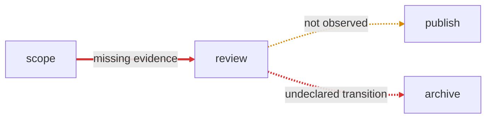

# GraphCheck

GraphCheck compares a **declared workflow graph** with one **explicit execution trace**. It catches mismatches that are easy to hide in a diagram: undeclared transitions, missing evidence IDs, unbounded cycles, fan-out with no named reducer, and unguarded side effects.

It is a small, Python-standard-library MVP. It does not run agents and it does not replace LangGraph, AutoGen, Google ADK, or the OpenAI Agents SDK.

## Quickstart

Requires Python 3.11+.

```bash
python -m graphcheck examples/healthy/graph.json examples/healthy/trace.json
python -m graphcheck examples/broken_edges/graph.json examples/broken_edges/trace.json --format json
python -m graphcheck examples/broken_edges/graph.json examples/broken_edges/trace.json --format mermaid
```

The command exits with `0` when there are no errors (warnings are allowed), `1` when audit errors exist, and `2` when an input cannot be read or does not match the schema.

### Concrete broken-edge result

The checked-in `broken_edges` trace produces this exact summary:

```text
GraphCheck: FAIL
errors=2 warnings=1 declared_edges=2 observed_transition_events=2

Diagnostics:
- ERROR MISSING_REQUIRED_EVIDENCE: Transition event 't1' lacks required evidence: scope-brief.
- ERROR UNDECLARED_TRANSITION: Observed transition 'review' -> 'archive' is not declared in the graph.
- WARNING EDGE_NOT_OBSERVED: Declared edge 'review' -> 'publish' was not observed in this trace; this does not prove the edge can never occur.
```

The same result as renderable Mermaid (red = broken contract, orange = not observed in this trace):



Optional local install:

```bash
python -m pip install -e .
graphcheck examples/healthy/graph.json examples/healthy/trace.json
```

## Graph schema (version 1)

```json
{
  "version": 1,
  "max_iterations": 5,
  "budget": {"cost": 2.0},
  "nodes": [
    {"id": "scope", "fan_out": true, "reducer": "reduce"},
    {"id": "reduce"},
    {
      "id": "publish",
      "side_effect": true,
      "approval": "human",
      "idempotency_key": "publish-${run_id}"
    }
  ],
  "edges": [
    {"from": "scope", "to": "reduce", "required_evidence": ["scope-brief"]}
  ]
}
```

- `nodes` is a non-empty list with unique string `id` values.
- `edges` is a list of unique `from`/`to` pairs. Both endpoints must be declared nodes.
- `required_evidence` is an optional list of evidence identifiers. GraphCheck compares identifiers only; it does not inspect whether the underlying evidence is true or sufficient.
- GraphCheck never infers parallelism from out-degree: two outgoing edges may be conditional routes. Only a node explicitly annotated with `fan_out: true` is treated as parallel fan-out; when it has multiple destinations, it must name a declared node in `reducer`. The MVP checks that the pointer exists, not that every branch truly converges there.
- A node with `side_effect: true` must have non-empty `approval` and `idempotency_key` strings. The MVP checks declarations, not enforcement.
- If the graph contains any cycle, the graph root must declare a positive `max_iterations` or positive `budget`. This is a global declaration and is not proof that a runtime enforces it.

## Trace schema (version 1)

```json
{
  "version": 1,
  "events": [
    {
      "id": "run-scope-1",
      "type": "node",
      "node": "scope",
      "started_at": "2026-07-24T08:00:00Z",
      "ended_at": "2026-07-24T08:00:02Z",
      "cost": 0.01
    },
    {
      "id": "edge-scope-reduce-1",
      "type": "transition",
      "from": "scope",
      "to": "reduce",
      "evidence": ["scope-brief"],
      "timestamp": "2026-07-24T08:00:02Z"
    }
  ]
}
```

- `events` must be non-empty. Every event has a unique string `id` and a `type` of `node` or `transition`.
- A transition is observed **only** when an explicit `transition` event exists. GraphCheck never infers edges from list order or adjacent node events.
- `evidence` contains evidence IDs carried by that transition event.
- Timestamps are optional ISO 8601 values with `Z` or a UTC offset. Timing metrics appear only when every node event has both `started_at` and `ended_at`; partial traces are not extrapolated.
- `cost` is optional and unitless. Total cost appears only when every node event has it. The producer decides whether the number means dollars, credits, or another unit.

## Diagnostics

| Code | Severity | Meaning |
| --- | --- | --- |
| `UNDECLARED_TRANSITION` | error | This trace explicitly took a transition absent from the graph. |
| `MISSING_REQUIRED_EVIDENCE` | error | An observed declared transition omitted one or more required evidence IDs. |
| `CYCLE_WITHOUT_LIMIT` | error | A declared cycle has no root `max_iterations` or `budget`. |
| `FANOUT_WITHOUT_REDUCER` | error | A node has multiple outgoing destinations but no named reducer. |
| `UNGUARDED_SIDE_EFFECT` | error | A side-effect node lacks `approval` or `idempotency_key`. |
| `UNDECLARED_NODE_EVENT` | error | A node event names a node absent from the graph. |
| `EDGE_NOT_OBSERVED` | warning | A declared edge did not appear in this trace. This does **not** prove it is impossible or dead. |

Mermaid output colors undeclared transitions and transitions with missing evidence red. A declared but unobserved edge is orange and dotted.

## Metrics, without pretending they are exact

With complete node timestamps, GraphCheck reports:

- `duration_total_seconds`: earliest node start to latest node end.
- `sum_node_durations_seconds`: sum of all node intervals.
- `approx_parallelism`: summed node duration divided by wall-clock span. This measures overlap, not worker utilization.
- `critical_path_approx`: longest chain in the explicit observed node-level transition graph, weighted by summed duration per node. Queue/wait time is excluded. For a cyclic observed graph it is unavailable because exact event-instance links would be needed.

With complete node costs it reports a unitless total. Missing coverage produces an explicit `available: false` reason rather than an estimate.

## Examples

- `examples/healthy`: complete fan-out/reduce/publish trace; passes and emits timing/cost metrics.
- `examples/broken_edges`: missing evidence, one undeclared transition, and one declared edge not observed.
- `examples/missing_limits`: unbounded cycle, fan-out with no reducer, and a side effect with no guards.

Run all dependency-free tests:

```bash
python -m unittest discover -s tests -v
```

## Limits

GraphCheck answers: "Does this declared graph agree with this explicit trace under this small contract?" It does **not** establish that:

- an unobserved edge is globally dead;
- evidence contents are correct;
- approvals, budgets, iteration caps, reducers, or idempotency keys are enforced;
- a graph is the right architecture for the task;
- timing or critical-path estimates are exact for repeated/cyclic node instances;
- traces are complete, authentic, or causally ordered.

Adapters, trace signing, framework-specific semantics, and runtime enforcement are deliberately outside this MVP.

## External selector and kill rule

Before adding features or publishing this as a serious tool, run it against **5 real workflows** (not synthetic fixtures), preferably across at least two runtimes. A diagnostic is a false positive when the workflow owner rejects it after inspecting the same graph and trace.

Continue only if the diagnostic-level false-positive rate is **under 20%** and at least one finding changes a real workflow, test, or guard. **Kill/archive the experiment** if fewer than 5 real workflows can be obtained within 14 days, the false-positive rate is 20% or higher, or no finding causes an external action. Do not expand the schema before that selector fires.

## Primary references

These sources establish that graph/workflow orchestration, parallel fan-out, loops, deterministic routing, guardrails, and tracing are existing engineering patterns. GraphCheck only tests a narrow declared-vs-observed contract around them.

- [LangGraph: workflows and agents](https://docs.langchain.com/oss/python/langgraph/workflows-agents)
- [Microsoft AutoGen: GraphFlow](https://microsoft.github.io/autogen/dev/user-guide/agentchat-user-guide/graph-flow.html)
- [Google Agent Development Kit: workflow agents](https://google.github.io/adk-docs/agents/workflow-agents/)
- [OpenAI Agents SDK: agent orchestration](https://openai.github.io/openai-agents-python/multi_agent/)
- [OpenTelemetry: traces](https://opentelemetry.io/docs/concepts/signals/traces/)

## License

MIT. See `LICENSE`.
