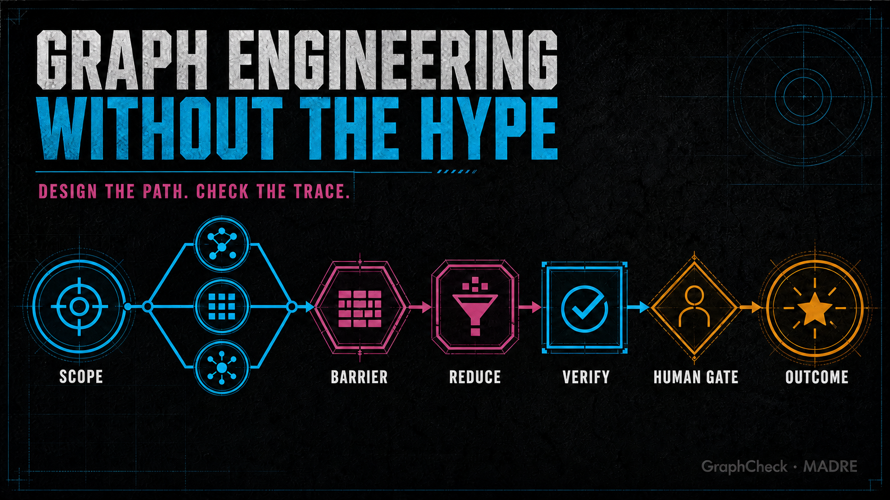

# Graph engineering without the hype



**A practical field guide to deciding when an agent workflow needs a graph, what each edge should carry, and how to check whether one explicit execution trace matches the declared design.**

Here, “graph engineering” informally means replacing a model-directed process with an explicit control-flow graph for tasks that require branching, parallel work, loops, or independent verification.

The graph itself is not the improvement. The improvement is making decisions, evidence, stop conditions, and side effects inspectable.

## Start with the smallest topology that can work

Anthropic recommends beginning with the simplest solution and adding agentic complexity only when it measurably improves outcomes. Its practical distinction is useful:

- A **workflow** follows predefined code paths.
- An **agent** dynamically chooses its own process and tools.

OpenAI’s Agents SDK makes a similar split between orchestration by the model and orchestration in code. Its documentation notes that code-driven orchestration makes speed, cost, and performance more deterministic and predictable; use it when those properties matter.

That gives us a simple topology ladder:

| Need | Smallest useful shape |
| --- | --- |
| One bounded transformation | One model call |
| Fixed stages with clear inputs | Linear chain |
| Independent subtasks | Fan-out → barrier → reducer |
| Different inputs need different specialists | Router → named branches |
| Output can be judged against explicit criteria | Generator ↔ evaluator loop |
| Path depends on runtime evidence | Conditional graph |
| Open-ended exploration | Orchestrator → workers, with budgets and stop rules |

If a chain is enough, a graph is ceremony. If the workflow already has hidden branches and retries, refusing to model the graph is hidden complexity.

## Six checks to test on a real workflow

### 1. Give every node one decision

A node should have a bounded responsibility and a predictable output. “Research everything, judge it, rewrite it, publish it” is not one node; it is an untestable program disguised as a prompt.

Useful node contracts look like:

- classify the request into one of four routes;
- retrieve three primary sources;
- evaluate one claim against a rubric;
- approve or reject one side effect.

This is why focused specialist calls can outperform one overloaded generalist: each call gets a smaller problem and a clearer success condition.

### 2. Parallelize independence, not uncertainty

Anthropic’s production patterns distinguish two good reasons for parallel work: **sectioning** independent subtasks and **voting** with deliberately different attempts. Its multi-agent research system uses an orchestrator-worker pattern in which a lead agent delegates searches to parallel subagents and synthesizes their results.

A correct parallel branch needs four explicit parts:

1. a split rule;
2. independent work units;
3. a barrier that knows when to stop waiting;
4. a named reducer that handles conflicts, gaps, and duplicates.

Fan-out without an explicit consumer leaves no defined place to reconcile conflicts, gaps, or duplicates.

### 3. Make every edge carry evidence

Most diagrams describe where control may go. Production traces describe where control actually went.

An edge should therefore carry a small, stable receipt:

```json
{
  "id": "edge-research-verify-2",
  "type": "transition",
  "from": "research",
  "to": "verify",
  "decision": "claim_ready_for_review",
  "evidence": ["source-03", "source-07"],
  "attempt": 2,
  "timestamp": "2026-07-24T18:00:00Z"
}
```

OpenTelemetry models a trace as related spans with identifiers, timestamps, attributes, events, and status. The exact telemetry system is optional; an explicit transition receipt is not. Without one, you cannot reliably distinguish “the graph allows this edge” from “this run took this edge.”

### 4. Put a stop rule on every cycle

Loops are valuable when one pass can improve the next. They are dangerous when “keep trying” is the only specification.

A useful evaluator-optimizer loop needs:

- a testable acceptance criterion;
- a maximum iteration, time, or cost budget;
- feedback that changes the next attempt;
- a terminal state for “cannot prove success.”

Scheduling a loop more often does not make it learn. Adaptation happens only when a test, tool result, human judgment, or outside signal changes the next pass.

### 5. Treat side effects as a different class of node

Reading a file and publishing a post should not share the same guardrails. A side-effect node should declare at least:

- the required approval;
- an idempotency key;
- the state captured before mutation;
- a rollback or compensation path;
- the evidence retained afterward.

For long-running or failure-prone work, durable execution matters too. Temporal’s model persists workflow progress in an event history so an execution can resume after crashes or outages. You may not need Temporal, but you do need an answer to the same question: **what happens after the process dies halfway through?**

### 6. Compare the declared graph with the observed run

A beautiful graph can still lie.

Common mismatches include:

- the runtime takes an undeclared transition;
- an edge arrives without its required evidence;
- a declared cycle has neither a root `max_iterations` nor a budget;
- a declared fan-out with multiple destinations does not name a reducer;
- a side-effect node lacks non-empty `approval` or `idempotency_key` declarations;
- a declared edge never appears in the trace.

The last item needs restraint: one unobserved edge does **not** prove the edge is dead. It only proves that the edge was not present in the trace you inspected.

That narrow distinction is the reason [GraphCheck](../README.md) exists. It compares one declared workflow graph with one explicit execution trace and reports only what that pair can support.

It does not verify that evidence is true, guards are enforced, branches converge, or the trace is complete, authentic, or causally ordered.

## A reference “diamond” workflow

```text
                 ┌─ specialist A ─┐
SCOPE ── fan-out ├─ specialist B ─┤── BARRIER ── REDUCE ── VERIFY ── HUMAN GATE ── OUTCOME
                 └─ specialist C ─┘
```

This shape is useful when:

- the scope can be split into genuinely independent work;
- waiting for all branches is justified;
- one reducer owns deduplication and conflict resolution;
- verification is separate from synthesis;
- only the final node is allowed to cause an external side effect.

It is the wrong shape when a single call can do the job, branches depend heavily on one another, or the reducer has no principled way to reconcile disagreement.

## What to measure

Do not grade the system by how impressive the diagram looks. Measure the run:

- wall-clock duration;
- sum of node durations;
- observed overlap, not claimed worker count;
- retries and loop iterations;
- cost coverage and missing telemetry;
- undeclared transitions;
- evidence missing at boundaries;
- human interventions;
- task-level quality on an external evaluation.

The final metric must live outside the graph. A system cannot prove its own usefulness by producing a green internal dashboard. Use a test suite, a human decision, a production outcome, or another external selector.

## A deliberately small test

GraphCheck is an experiment, not a new orchestration framework. Try it against one real graph and one real trace:

```bash
python -m graphcheck graph.json trace.json
```

Within 14 days of starting the experiment, test five real workflows from at least two runtimes. For every diagnostic, have the workflow owner mark it accepted or rejected after inspecting the same graph and trace. Continue only if rejected diagnostics / total diagnostics is below 20% and at least one accepted finding changes a workflow, test, or guard; otherwise archive the experiment.

## Primary sources

- [Anthropic: Building effective agents](https://www.anthropic.com/engineering/building-effective-agents)
- [Anthropic: How we built our multi-agent research system](https://www.anthropic.com/engineering/multi-agent-research-system)
- [OpenAI Agents SDK: Agent orchestration](https://openai.github.io/openai-agents-python/multi_agent/)
- [Google ADK: Graph and template workflows](https://adk.dev/agents/workflow-agents/)
- [Microsoft AutoGen: GraphFlow](https://microsoft.github.io/autogen/dev/user-guide/agentchat-user-guide/graph-flow.html)
- [LangGraph: Workflows and agents](https://docs.langchain.com/oss/python/langgraph/workflows-agents)
- [OpenTelemetry: Tracing specification overview](https://opentelemetry.io/docs/specs/otel/overview/)
- [Temporal: Durable execution](https://docs.temporal.io/temporal)

---

*GraphCheck · MADRE, July 2026. The claims above are intentionally narrower than the diagrams. Code and examples: [MIT License](../LICENSE).*
